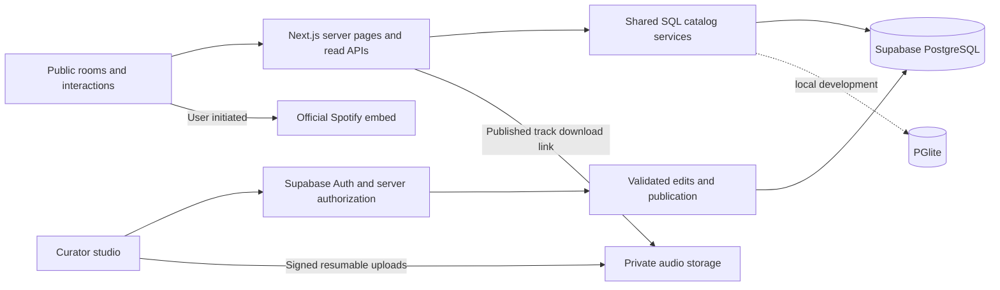

# WE LOVE OVO / Toronto After Dark

A cinematic Drake discovery and learning app: five rooms over a persistent Toronto nightscape, connected by a branching timeline of eras, records, tracks, artists, and milestones. Explore song cards, open a random song, or learn the catalog through four quiz modes. The app preserves the original 414-track collection, 117 releases, 104 credited artists, and six career chapters.

[Visit WE LOVE OVO](https://www.weloveovo.com) · [Game Room](https://www.weloveovo.com/games) · [License](LICENSE)

**Proprietary project — all rights reserved.** The original code, design, and project content are not offered under an open-source license. Reuse requires the rights holder's written permission, subject to the exceptions in [LICENSE](LICENSE). Setup instructions below are for the owner and authorized developers.

## Run locally

Use Node 24 LTS (or Node 22+), then:

```bash
npm ci
npm run dev
```

Open **http://127.0.0.1:3000**. No service credentials are needed to explore the public app. It runs its SQL queries against an embedded, in-memory PostgreSQL database (PGlite), seeded from the versioned catalog. The database is rebuilt when that server process restarts. This mode has no curator access or downloadable audio.

The former static `index.html` has been replaced by Next.js routes. `npm run build` and `npm start` provide the production server; opening a local HTML file is no longer the entrypoint.

## The experience

- **Lobby `/`** — four main entrances plus a Game Room link; persistent room switcher, skyline, random-song button, and effects control.
- **Records `/records`** — featured projects or all releases, with `/records/[id]` detail pages.
- **Eras `/eras`** — six chapters with their own `/eras/[id]` stories and records.
- **Listening Room `/listening-room`** — server-side search, mood/release/era/explicit filters, sorting, pagination, and browser-local favorites. Press `/` to search.
- **Game Room `/games`** — ten-question learning rounds for song-to-release matching, album artwork, release years, and collaborators. Answers are checked on the server and explain the catalog connection. Replay missed questions; study counts stay in browser-local storage.
- **Tracks `/tracks/[spotifyId]`** — musical traits, related tracks with explanations, Spotify, and published MP3 downloads.
- **Legacy `/legacy`** — sourced stories and milestones.
- **Connections `/connections`** — an expandable chronological graph with an equivalent list view. Tab to a node and press Enter or Space to expand it. Optional `?root=era:the-blue-hour`, `release:take-care-deluxe`, or `track:<Spotify ID>` opens a neighborhood.
- **Curator `/admin`** — protected metadata, drafts, publishing, connections, and audio management when hosted services are configured.

Spotify loads only after Listen is selected. Its iframe remains mounted during room navigation and while the tray is collapsed; closing the tray removes it. Playback availability depends on Spotify and the visitor's account/browser. External Spotify and Apple Music links remain available. No audio is autoplayed or extracted from Spotify.

Favorites reuse the existing `weloveovo.favorites` storage key and Spotify IDs. If storage is blocked, they work for the current visit. Effects honor reduced motion, pause when the page is hidden, and can be disabled independently. There are no public accounts, comments, ratings, locked chapters, or progress gates.

The Listening Room defaults to clickable song cards, with a URL-backed Track list option. Every song file includes a reading section generated from its catalog metadata, performer credits, and release edition. The header's Random song button selects a track on the server, excludes the current song, and opens its page without autoplay. The Game Room is linked from the lobby and Rooms menu; `/games?mode=release`, `cover`, `year`, and `credits` preselect a mode. Quizzes use this collection's release editions, not claims about a song's earliest release. Lyric quizzes are deferred until a permitted lyric source is supplied.

Learning progress uses `weloveovo.learning.v1`. It records question totals and distinct studied Spotify IDs, remains separate from favorites, and falls back to the current visit when storage is blocked. Games are for personal practice, with no competitive scores or public account requirements.

## Architecture



- **Frontend:** Next.js App Router, React, TypeScript, CSS Modules, Motion, React Flow, and Lucide. Album art and the skyline are local assets. Google Fonts have system fallbacks.
- **Backend:** shared parameterized PostgreSQL queries power server pages and route handlers. Full-text search uses a GIN-indexed document plus escaped partial-title/artist/release matching. The full catalog is not shipped to the public client.
- **Recommendations:** deterministic distances across energy, danceability, brightness, and tempo, with shared-collaborator and same-release adjustments. The selected track is excluded.
- **Data:** normalized releases, tracks, artists, credits, eras, milestones, curated connections, editorial drafts, and audio attachments. Each track also retains its complete original metadata in `raw`.
- **Editorial:** Save draft leaves the live row unchanged. Publish promotes the reviewed content; Unpublish removes editorial content from public queries. Imports insert missing records without overwriting curator edits.
- **Access:** visitors use read APIs. Curators must have a valid server-verified session, an allowlisted email, and a row in `curators`. Every mutation validates the origin and authorization. Public/authenticated direct table writes are denied; privileged keys stay in server modules.

## Connect Supabase

1. Create a Supabase project. Copy `.env.example` to `.env.local` and set:
   - `DATABASE_URL`: the project's PostgreSQL connection string. A session/transaction pooler connection is supported; prepared statements are disabled.
   - `NEXT_PUBLIC_SUPABASE_URL` and `NEXT_PUBLIC_SUPABASE_PUBLISHABLE_KEY`.
   - `SUPABASE_SERVICE_ROLE_KEY`: **server only**; never prefix this with `NEXT_PUBLIC_`.
   - `CURATOR_EMAILS`: comma-separated invited email addresses.
   - `NEXT_PUBLIC_SITE_URL`: the exact origin used in the browser, such as `http://127.0.0.1:3000` locally or your production HTTPS origin.
2. Apply schema and policies, then import the catalog:

   ```bash
   npm run db:migrate
   npm run db:seed
   ```

3. In Supabase Auth, disable public signups and invite/create your curator user. Add its UUID with the SQL editor:

   ```sql
   insert into public.curators (user_id)
   values ('YOUR-INVITED-USER-UUID')
   on conflict do nothing;
   ```

4. Add the app origin to the Supabase Site URL and allow the `/auth/confirm` callback. Configure the magic-link email template to use:

   ```text
   {{ .SiteURL }}/auth/confirm?token_hash={{ .TokenHash }}&type=email
   ```

5. Restart the app. Open `/admin`, request a sign-in link, and use the link in your email. The app never creates users through the public login form.

The migration creates a private `track-audio` bucket with a 100 MB per-file limit and MP3 MIME restriction. Supabase project-level storage limits must also permit your file sizes. Authenticated visitors cannot grant themselves curator status. Both database and bucket access policies are versioned with the schema.

## Import and publish your MP3s

1. Open **Curator → Audio** and select your MP3 files. Files remain outside this Git repository.
2. Review suggested matches from embedded titles, filenames, or Spotify IDs. Ambiguous/unmatched files require choosing the track; each match must be confirmed.
3. Upload confirmed files. Transfers go directly to Supabase using expiring signed upload tokens and resumable TUS chunks. Progress and retry are available. Recent upload tickets stay in session storage so reselecting the same file in the same tab can resume an interrupted transfer.
4. The server checks the uploaded size and parses the actual MPEG Layer III audio stream. Pending or failed files cannot be published.
5. Publish verified attachments. Only one attachment is published per track; replacing it safely retires the previous attachment. The coverage counter shows how many of the 414 tracks have downloads.
6. Track pages issue short-lived download URLs with a readable `.mp3` filename. Unpublish removes the download from the app immediately; an already-issued URL can remain usable for up to 60 seconds.

Use audio you are authorized to distribute. Spotify embeds and supplied download files are separate sources. No empty links are shown for tracks without a published file. Curator uploads require a configured Supabase project; this repository does not include the owner's audio collection.

## Read interfaces

| Endpoint                       | Behavior                                                                                                                                                                                    |
| ------------------------------ | ------------------------------------------------------------------------------------------------------------------------------------------------------------------------------------------- |
| `GET /api/tracks`              | Search using `q`, `release`, `artist`, `era`, `year`, `mood`, `clean`, `sort`, `page`, `limit`, and optional comma-separated favorite `ids`. Returns tracks, total, page, pages, and limit. |
| `GET /api/tracks/:id/related`  | Related tracks with deterministic scores and explanations.                                                                                                                                  |
| `GET /api/graph?root=…`        | Nodes and labeled edges for an era, release, or track neighborhood.                                                                                                                         |
| `GET /api/tracks/:id/download` | Redirect to a signed attachment URL for published audio; 404 when unavailable.                                                                                                              |

Search limits are validated: page size 1–50, query length up to 120 characters, and an explicit sort/mood allowlist. Bad filters return 400; missing tracks return 404; unexpected service failures return a recoverable 503. Admin JSON endpoints under `/api/admin` are session-protected and are not public content APIs.

The download endpoint also accepts `Accept: application/json` to return `{ url }` without redirecting. The track page uses this to display retry feedback if signing fails; the MP3 still downloads directly from storage.

`GET /api/tracks/random?exclude=<Spotify ID>` returns an existing random track ID. `GET /api/games?mode=release|cover|year|credits` returns up to ten questions with four distinct choices each, without the answers. `POST /api/games/answer` accepts `{ id, mode, choice }` and checks the answer against current catalog data, returning feedback and the song metadata. These endpoints do not cache randomized rounds or write to the catalog. No new migrations or environment variables are needed for games or song cards.

## Checks

```bash
npm run typecheck
npm test
npm run test:ui
npm run build
npm run test:e2e
npm run format:check
```

Backend tests run real PostgreSQL queries through PGlite, including metadata preservation, search, imports, draft visibility, publication transitions, and access policies with isolated Auth/Storage schema fixtures. Audio tests parse synthetic MPEG frames and exercise storage failure/retry and signed-download behavior with a test provider; they do not claim to verify a live Supabase account. Curator component tests cover matching review, resumed transfers, verification retries after reload, and explicit editorial/audio publication.

Playwright covers direct routes, history, URL filters, favorite migration/persistence, map/list navigation, persistent embeds, mobile widths, reduced motion, and anonymous access rejection. It uses installed Google Chrome on macOS when available; elsewhere run `npx playwright install chromium`. Set `PLAYWRIGHT_CHROMIUM_EXECUTABLE_PATH` to use another Chrome/Chromium installation. Visual captures and failure traces go into the ignored `test-results/` directory.

To run these browser checks against the production build, stop other servers on port 3000, run `npm run build`, then `PLAYWRIGHT_PRODUCTION=true npm run test:e2e`.

For an isolated public-catalog test server while your local Supabase app runs, use `PLAYWRIGHT_CATALOG_FIXTURE=true PLAYWRIGHT_PORT=3100 npm run test:e2e`. This explicitly clears hosted credentials for the test server, uses the bundled PostgreSQL catalog, and leaves `.env.local` unchanged. Browser tests also cover game completion, missed-answer review, saved study progress, song cards, random discovery, and mobile/keyboard play.

## Deploy to Vercel

1. Import this GitHub repository into Vercel using the **Next.js** preset and the repository root directory.
2. Configure the environment values above; use the deployed HTTPS origin for `NEXT_PUBLIC_SITE_URL`. Apply migrations and seed once to the connected Supabase project before enabling curator access.
3. Add the deployed callback URL in Supabase Auth. For curator-enabled previews, configure that preview origin explicitly; use a separate database/project when experimenting with data.
4. Deploy and check the lobby, a directly loaded record/track URL, database search, curator sign-in, a test upload, publication, and the resulting download.

Without hosted credentials the public app runs the bundled PostgreSQL catalog; curator features stay unavailable. For the full hosted experience, monitor Vercel function logs and Supabase database, authentication, storage, and egress usage. Service provisioning, SMTP delivery, and real audio availability depend on the owner's configured accounts and supplied files.

## Content and credits

The collection reflects the supplied library, not a claim to contain every recording or every version. `data/tracks.json` preserves the original source and `data/catalog.json` is its normalized seed. To add catalog content through version control, maintain the normalized seed and run the idempotent import; public metadata can be edited through the curator studio.

- [Drake on Apple Music](https://music.apple.com/us/artist/drake/271256): release information, artist context, and OVO Sound background.
- [Recording Academy](https://www.grammy.com/artists/drake/12370/): the first Grammy win for _Take Care_ in 2013.
- Cover art is from Apple's music catalog and belongs to its respective rights holders.
- The Toronto nightscape is original AI-generated editorial artwork, an imagined view rather than a documentary photograph.

Independent fan-made project. Not affiliated with Drake, OVO, Spotify, or Apple Music.

## License and permissions

Copyright (c) 2026 Jeffjone. All rights reserved in the original, copyrightable project material owned by Jeffjone. See [LICENSE](LICENSE) for the governing terms.

Without prior written permission, you may not copy, modify, redistribute, sell, sublicense, or deploy that material as another website or product, except as permitted by applicable law or the license's express exceptions. Giving credit alone does not grant permission. Request permission from [Jeffjone on GitHub](https://github.com/Jeffjone); permission must be explicitly granted in writing.

This notice does not claim ownership of Drake's music, lyrics, album artwork, third-party trademarks, factual catalog data, or other third-party material. Dependencies and separately licensed assets retain their own terms. The AI-generated skyline is subject only to rights that actually exist under applicable law.

Visitors may use the deployed site through its intended interface. This license does not prevent copying technically or override rights granted under [GitHub's Terms of Service](https://docs.github.com/en/site-policy/github-terms/github-terms-of-service), including viewing and forking a public repository within GitHub. See [GitHub's licensing guidance](https://docs.github.com/en/repositories/managing-your-repositorys-settings-and-features/customizing-your-repository/licensing-a-repository). Keep the repository private if source access should be limited to authorized collaborators; browser-delivered site assets remain accessible to visitors.
